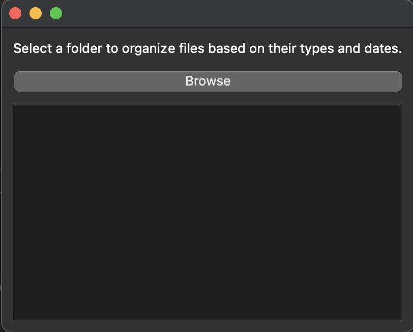
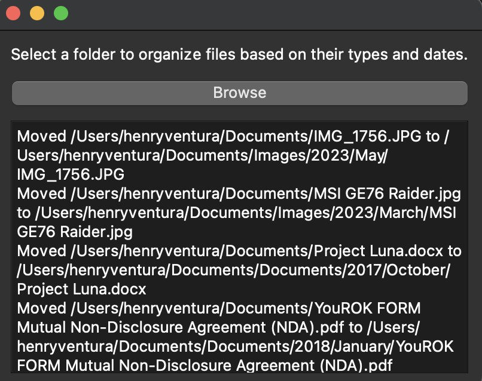
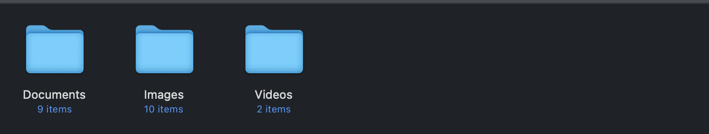
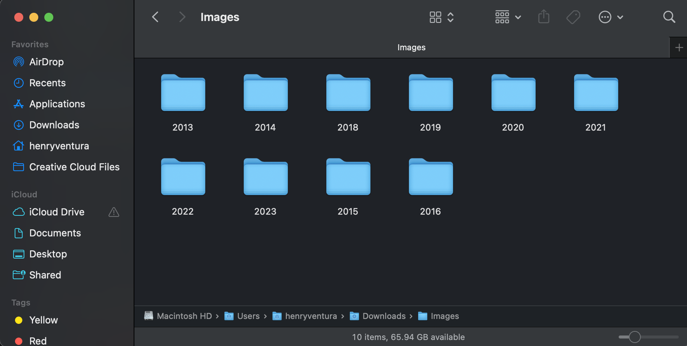
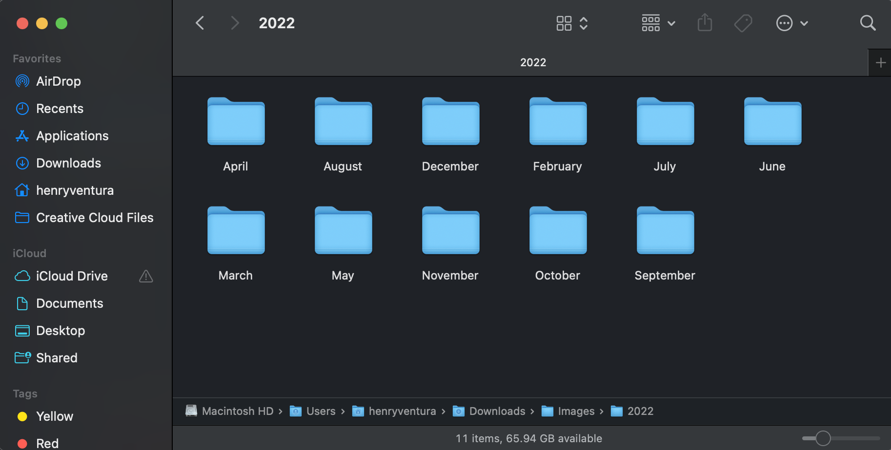

# File Organizer

FileOrganizer is a desktop application that helps you organize your files by categorizing them into folders based on their file types (images, videos, and documents) and sorting them into subfolders by their creation or modification dates.

## Features

- Categorizes files into folders for images, videos, and documents/PDFs.
- Sorts files within each category into subfolders based on their date (mm/yyyy).
- Supports various file formats, including JPEG, HEIC, PNG, PDF, and more.

## Installation

1. Ensure you have Python 3.7 or higher installed on your system.
2. Install the required Python libraries:
python3 -m pip install PyQt5 python-magic Pillow python-dateutil pyheif

Note: macOS users may need to install additional dependencies for `pyheif`:

3. Clone this repository or download the source code.

## Usage

1. Navigate to the directory containing the `file_organizer.py` script in your Terminal or Command Prompt.
2. Run the application:

## Screenshots

### The main GUI screen

### After successfully organizing the files

### The categories of the folders created

### The files are seperated into years

### The files are lastly seperated into months

